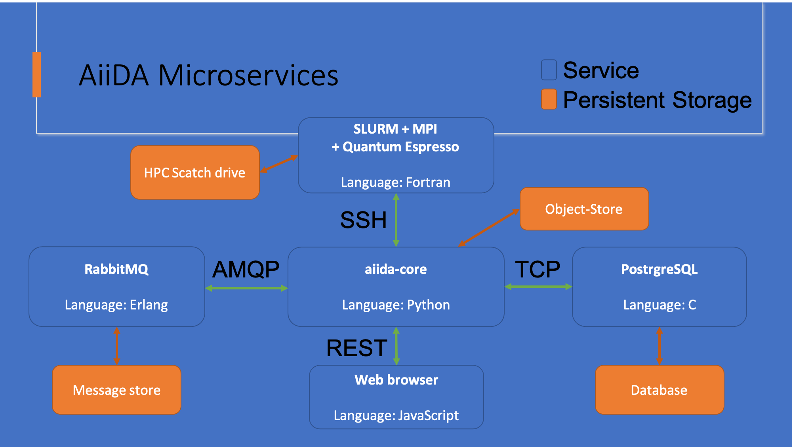

# AiiDA Install Tutorial

[](https://open.vscode.dev/chrisjsewell/aiida-install)

Repository: https://github.com/chrisjsewell/aiida-install

The tutorial is fully reporoducible using a [VS Code Deveopment Container](https://code.visualstudio.com/docs/remote/containers).
It is run using Linux, but should also be applicable to other Operating Systems (MacOS, Windows Subsystem for Linux, etc).

This tutorial is based on the information at: <https://aiida.readthedocs.io/projects/aiida-core/en/latest/intro/get_started.html>, where you can find further information.
(see also the troubeshooting section: <https://aiida.readthedocs.io/projects/aiida-core/en/latest/intro/troubleshooting.html>)

## Setting up a Python virtual environment

This is important, the ensure the environment remains correct, it is recommended for any Python based projects.

Using Python `venv` is the simplest way to achieve this, as we do here.
You could aso use [Conda](https://docs.conda.io), which additionaly allows for installing non-python packages like postgres, rabbitmq and even [quantumespresso](https://anaconda.org/conda-forge/qe)!

> `conda create -n aiida -c conda-forge aiida-core=1.6 aiida-core.services`

```
python -m venv .venvs/aiida
source .venvs/aiida/bin/activate
pip list
pip install -U pip setuptools wheel
pip install "aiida-core~=1.6.4"
pip list
pip check
```

When first calling `verdi` you may note that it may error.

```
verdi
```

This is because we first need to call `reentry`, to update all the plugins.

```
reentry scan
verdi
verdi status
```

From the status, you may note that the work path defaults to `.aiida` in your home directory.
When working on multiple AiiDA projects, it may be helpful to change this, using the `AIIDA_PATH` environmental variable.

```
export AIIDA_PATH="/workspaces/aiida-install/.aiida"
verdi status
```

To add tab completion for the `verdi` CLI, run:

```
# for mac users
# autoload -Uz compinit && compinit
eval "$(_VERDI_COMPLETE=source verdi)"
verdi <TAB>
```

To automate the path and completion setup, we can add these two commands to our environment activation script:

```
echo "export AIIDA_PATH=\"/workspaces/aiida-install/.aiida\"" >> .venvs/aiida/bin/activate
echo "$(_VERDI_COMPLETE=source verdi)" >> .venvs/aiida/bin/activate
```

(Note in in VS Code, you can also set "terminal.integrated.env.linux" or in Conda see: <https://conda.io/projects/conda/en/latest/user-guide/tasks/manage-environments.html#setting-environment-variables>)

## Setting up the AiiDA services and profile

AiiDA uses a number of external services to run.
Note these services are not actually required to be on your local system, they are accessed by AiiDA using web-based protocols.
For this demonstration though, we shall set them up locally.



### Postgres database

To read/write all the data AiiDA uses, the principle service is a "backend" database. AiiDA principally uses [PostgreSQL](https://www.postgresql.org/) for this purpose.

```
sudo apt update
sudo apt install postgresql postgresql-server-dev-all postgresql-client rabbitmq-server
# container only command
sudo chown -R vscode:vscode /var/run/postgresql
/usr/lib/postgresql/11/bin/initdb .aiida/database
/usr/lib/postgresql/11/bin/pg_ctl -D .aiida/database -l .aiida/postgres.log start
```

(set `PGDATA` environmental variable, to use pg_ctl without `-D`)

We can now set up our AiiDA profile.
`verdi quicksetup` can automatically search for the running PostgreSQL service, store the connections details and set up the initial database schema:

```
verdi quicksetup --help
verdi quicksetup
verdi status
verdi profile show
verdi config list
verdi database summary -v
```

Alternatively, you can use a [YAML](https://en.wikipedia.org/wiki/YAML) configuration file:

```
verdi quicksetup --config quicksetup.yml
verdi profile list
```

We now have multiple profiles set up and you can switch between them.

Note YAML configuration files can also be used for setting up computers and codes. See <https://github.com/aiidateam/aiida-code-registry> for some examples.

### Rabbitmq process messaging

This service is only required when you want to run processes (not to access data). [RabbitMQ](https://www.rabbitmq.com/) handles storing what processes are running and enables them to persist e.g. if you turn off your computer.

```
sudo rabbitmq-server -detached start
```

(see <https://aiida.readthedocs.io/projects/aiida-core/en/latest/intro/troubleshooting.html#rabbitmq-installation-unix> if you have issues with this.)

```
verdi status
```

To handle the actual running of the processes, we need to start one or more "daemon" (a.k.a background) processes.
You can start as many as you want, but should limit to the number of actua CPUs on your computer.

```
verdi daemon start 2
verdi status
verdi daemon status
```

## Using AiiDA archive

You can import archives from local files or remote URLs:

```
verdi archive import "https://archive.materialscloud.org/record/file?filename=HiCond_bands_calculations.aiida&file_id=ee287780-ac04-4b8b-b03c-3cea6e446f9d&record_id=477"
verdi database summary -v
```

You can create an archive from one or more computers/codes/groups/nodes:

```
verdi group list -a -A
verdi archive create -G 2 -- myarchive.aiida
verdi archive inspect myarchive.aiida
```

## Using Jupyter Lab

```
pip install jupyterlab
mkdir -p ~/.ipython/profile_default/startup/
cp aiida_magic_register.py ~/.ipython/profile_default/startup/
jupyter lab
```

Now open `Example.ipynb` and trying running AiiDA.

Note, you can also use Jupyter within VS Code: <https://code.visualstudio.com/docs/datascience/jupyter-notebooks>
